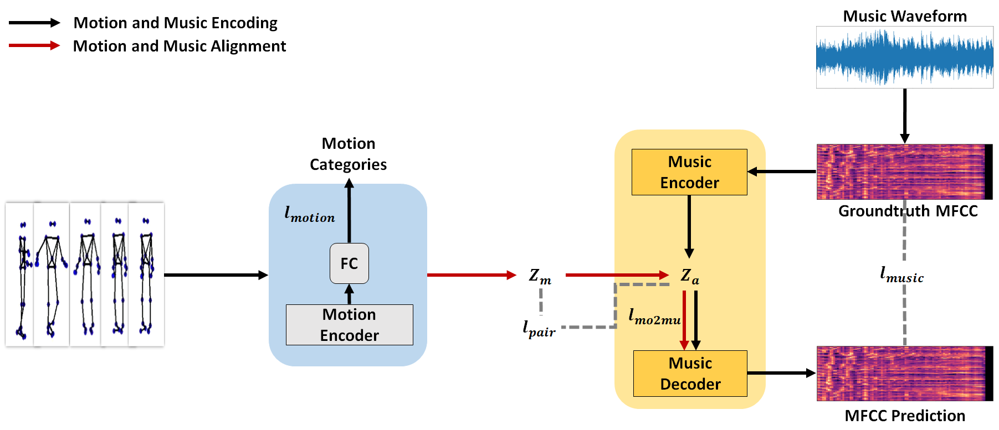

# MCLEMM: Multi-modal Collaborative Learning Encoder for Enhanced Music Recommendation

This is the repository of the method presented in the manuscript "Multi-modal collaborative learning encoder for improving the accuracy of
music recommendation" by Wenjuan Gong, Qingshuang Yu, etc. The manuscript was submitted to a peer review journal. 

## Data preparation
1. Start by downloading the [MusicToDance](https://github.com/Music-to-dance-motion-synthesis/dataset) datasets and [AIST++](https://google.github.io/aistplusplus_dataset/download.html) datasets and put them under the /datasets folder.
2. Run the data feature extraction code.\
 `python3 ./data_pre/m2d_music_motion.py` Extract the joint features of the MusicToDance dataset and divide the train,valid,test.\
  `python3 ./data_pre/aist_moiton_music.py`Extract the joint features of the AIST++ dataset and divide the train,valid,test.\
  `python3 ./data_pre/gen_bone.py`Extract the bone features of the MusicToDance and AIST++ dataset and divide the train,valid,test.\
  `python3 ./data_pre/emerged_bone_joint.py`Emerged the joint features and the bone features of the MusicToDance and AIST++ dataset.\
3. The extracted features of the MusicToDance and AIST++ dataset held in the folder /data
4. We provide the data in [Baidu Netdisk](https://pan.baidu.com/s/1fTV7uZs4oQZwfyY1bWFaTQ?pwd=prmi)  Extraction code ：prmi

## Train the model
`python3 train_dual_ae_DWM.py --config_file ./configs/dual_ae_c.json`\
‘train’ parameter in the train_dual_ae_DWM.py determine whether to train or test.\
‘data_dirs’ parameter in the train_dual_ae_DWM.py determine which experiment to run.\
ensemble.py combines experimental result from joint and bone.\
./saved_models saved the experimental model.\
We provide the pre-trained model in [Baidu Netdisk](https://pan.baidu.com/s/1vILpFAsCVsob6LMxWxy_tw?pwd=prmi ) Extraction code: prmi

## To check the performance of the proposed method
./confusion_matrix.py Get the confusion matrix of the experimental results.\
./draw_video.py Generate the music video.

## Multimedia Demo
Here is an exemplar video of a dancing avatar with background music recommended using the proposed method. 
The dancing motion sequences are originally from the ``Cha-cha'' category of MusicToDance dataset. 

<video src= https://user-images.githubusercontent.com/47975404/153193475-0b8803f6-8c34-4ba0-b3c4-d855240eddea.mp4 width=180/>

